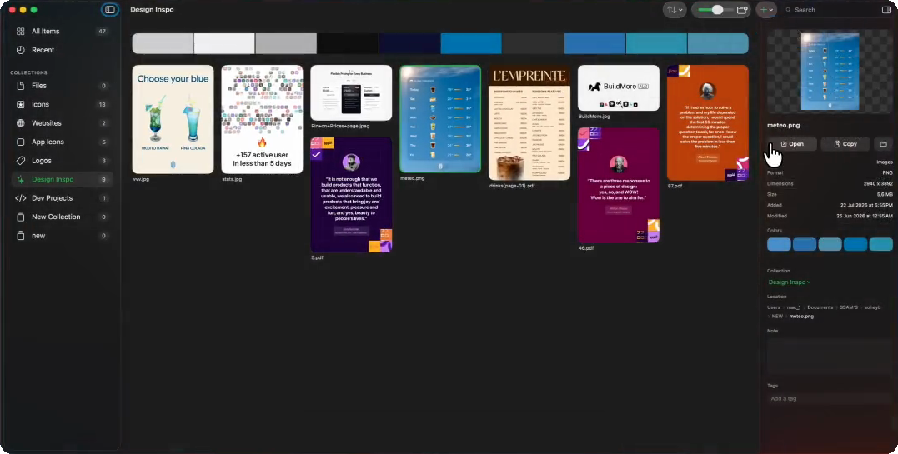

<h1 align="center">Shelf</h1>

<p align="center">
A native macOS library for your raw material.<br>
Images, fonts, videos, links, palettes, and dev projects in one place, and your files are never duplicated.
</p>



## Why this exists

If you design or build things, you collect things: screenshots of pricing pages, logos you liked, fonts you bought, icons, links you will "definitely need later". That pile ends up scattered across Downloads, the Desktop, browser bookmarks, and seventeen folders named `inspo`.

Apps that solve this usually do it by importing everything into their own library. Now you have two copies of every file, one of them locked inside somebody's database.

Shelf takes the other path. When you add a file, Shelf stores a reference and builds a preview. The original never moves and is never copied. Rename your folders, keep your files on an external drive, organize them however you like. Shelf keeps up, and the library still renders from its preview cache even when the drive is unplugged.

## What it does

**Collect anything.** Images (including SVG), fonts, videos, PDFs, design files, web links, and entire dev project folders. Drag things in, use the Add menu, or press paste.

**Add from anywhere.**
- Right click any image on the web and pick "Add to My Shelf" (Safari, Chrome, and Arc extensions included, with an in-app setup guide).
- Right click any file in Finder and pick "Add to My Shelf".
- Other apps can talk to Shelf through the `shelf://` URL scheme.

**Find it again.**
- Search matches names, file types, tags, and link domains.
- On-device image classification (Apple Vision) labels your images so "poster" or "coffee" finds them, with synonym matching so close words work too.
- Color search: type "red", a color name, or a hex code to find images by their dominant colors.

**Work with color.** Every collection gets a palette distilled from what is in it. Click a swatch to copy the hex. Export any collection as a moodboard image with its palette attached.

**Quick Shelf.** Press Option-Space in any app for a Spotlight-style panel. Search your library, copy an item, or drag it straight into whatever you are working on.

**Links that look like their content.** Web links show their Open Graph image, and YouTube and Vimeo links show the video thumbnail and title.

**Dev projects too.** Add a project folder and Shelf records its languages and file count, and can open it in VS Code or in Claude Code in one click.

**Native playback.** Videos play in-app in an AVKit lightbox. Images expand to full resolution without a round trip through Preview.

## Privacy

There is no account, no backend, and no analytics. The only thing Shelf ever uses the network for is fetching link previews, and you can turn that off in Settings. Everything else, including image classification and semantic search, runs on device.

## Install

Download the DMG from [Releases](../../releases), open it, and drag Shelf to Applications.

Shelf requires **macOS 26 (Tahoe)** or later. It is built on the Liquid Glass APIs and SwiftData, so it does not run on earlier systems.

## Build from source

You need Xcode 26 on macOS 26.

```sh
git clone <this repo>
cd shelf
./run.sh
```

`run.sh` builds the app and launches it. Or open `Shelf.xcodeproj` and hit Run. There are no dependencies to install; the only package is `ShelfUI`, which lives in this repo.

## How it is built

- Swift and SwiftUI throughout, with SwiftData for the library. Zero third-party dependencies.
- The design system is an isolated local package, `Packages/ShelfUI`: spacing, radius, motion, and shadow tokens plus the shared components. The app does not hard-code styling outside it.
- Liquid Glass comes from the real system APIs (`glassEffect`, `GlassEffectContainer`), not recreated blur.
- Files are referenced with security-scoped bookmarks; previews come from QuickLook and are cached to disk, with a downsampled in-memory layer for scrolling.
- Image labels come from the Vision framework, synonym expansion from NLEmbedding, and the global hotkey from Carbon, so none of it needs a network or special permissions.
- The app is sandboxed.

## Contributing

Issues and pull requests are welcome. Keep changes small and focused, match the style of the surrounding code, and route any new UI through the ShelfUI tokens rather than ad-hoc values. `./run.sh` is the whole dev loop.

If Shelf is useful to you, a star helps other people find it.

## License

[MIT](LICENSE)
