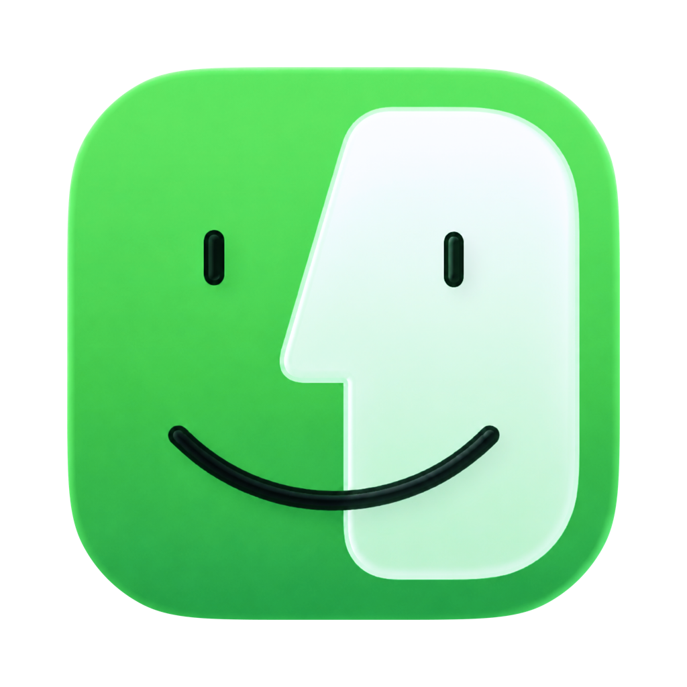
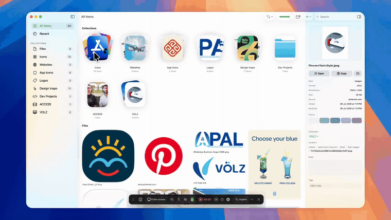
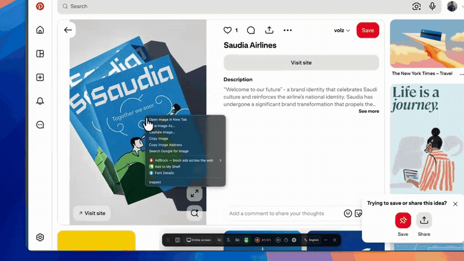
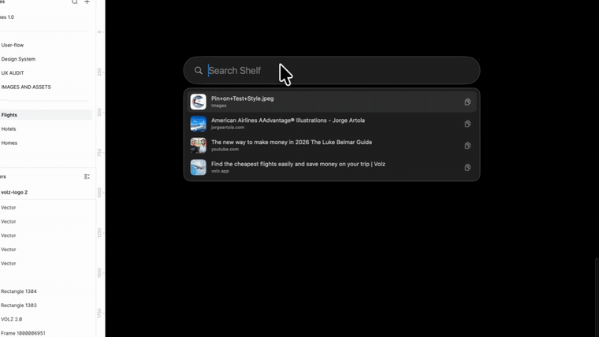

<p align="center">
  
</p>

<h1 align="center">Shelf</h1>

<p align="center">
A native macOS library for your raw material.<br>
Images, fonts, videos, links, palettes, and dev projects in one place, and your files are never duplicated.
</p>

<p align="center">
  
  
  
  
</p>



<p align="center">
  <a href="../../releases/download/v1.0.0/demo.mp4">Watch the full one minute demo</a>
</p>

## 🗂️ Why this exists

If you design or build things, you collect things: screenshots of pricing pages, logos you liked, fonts you bought, icons, links you will "definitely need later". That pile ends up scattered across Downloads, the Desktop, browser bookmarks, and seventeen folders named `inspo`.

Apps that solve this usually do it by importing everything into their own library. Now you have two copies of every file, one of them locked inside somebody's database.

Shelf takes the other path. When you add a file, Shelf stores a reference and builds a preview. The original never moves and is never copied. Rename your folders, keep your files on an external drive, organize them however you like. Shelf keeps up, and the library still renders from its preview cache even when the drive is unplugged.

## 🧰 What it does

**Collect anything.** Images including SVG, fonts, videos, PDFs, design files, web links, and entire dev project folders. Everything renders as a real preview, not a generic icon, and transparent PNGs sit on a checkerboard in the inspector so you can tell them apart from white artwork.

**Add from anywhere.**
- Drag files in, or use the Add menu for files, dev projects, and links.
- Right click any image on the web and pick "Add to My Shelf". Extensions for Safari, Chrome, and Arc are included, with a setup walkthrough inside the app.
- Right click any file in Finder and pick "Add to My Shelf".
- Other apps can talk to Shelf through the `shelf://` URL scheme.



**Organize with collections.** Create them in one click, rename them inline like Finder folders, give each one its own SF Symbol icon and cover, and file items by dragging them onto a collection in the sidebar or the browse grid. Collections show as stacked card covers, and empty ones stay out of the browse view until they earn a card.

**Find it again.**
- Search matches names, kinds, file formats ("png" finds every PNG, "jpg" also hits JPEG), tags, and link domains.
- On-device image classification labels your images automatically, so "poster" or "coffee" finds them. Synonyms match too: "puppy" still finds an image labeled "dog". The detected tags show in the inspector, and clicking one searches for it.
- Color search: type "red", any color name, or a hex code to find images by their dominant colors.
- A search always covers the whole library, wherever you typed it.

**Work with color.** Every image gets its dominant colors extracted at import. Every collection distills them into a palette bar, and clicking a swatch copies the hex. Export any collection as a moodboard image, laid out on a clean grid with its palette attached.

**Quick Shelf.** Press Option-Space in any app for a Spotlight-style panel. Search your whole library, copy an item with one click, drag it straight into Figma or wherever you are working, or press Return to jump to it in the app.



**Links that look like their content.** Web links show their Open Graph art, YouTube and Vimeo links show the video thumbnail and title, and the inspector shows the source with the site's own icon. Link previews are the one thing that touches the network, and each link is fetched once.

**Dev projects too.** Add a project folder and Shelf records its languages, file count, and whether it is a git repo. Open it in VS Code or in Claude Code in one click.

**Preview without leaving.** Click a thumbnail in the grid to expand it to full resolution in a lightbox. Videos play right there in a native AVKit player with Liquid Glass controls. Space gives you the system Quick Look, Return in the inspector opens the original, and Reveal in Finder is always one click away.

**Details on hand.** The inspector shows kind, format, dimensions, size, dates, extracted colors, the collection, and the original's path as a clickable breadcrumb. Add your own tags and notes. Copy buttons confirm with a check for a moment, so you know it happened.

**It behaves like a Mac app.** One window, real Liquid Glass from the system APIs, light and dark mode, multi-select with Command and Shift, context menus everywhere, keyboard navigation, and respect for Reduce Motion and Reduce Transparency.

## 🔒 Privacy

There is no account, no backend, and no analytics. The only thing Shelf ever uses the network for is fetching link previews, and you can turn that off in Settings. Everything else, including image classification and semantic search, runs on device.

## 📦 Install

Download the DMG from [Releases](../../releases), open it, and drag Shelf to Applications.

The build is not notarized yet, so the first launch takes one extra step. macOS will say it could not verify the app; choose Done (not Move to Trash), then open **System Settings, Privacy & Security**, scroll down to the message about Shelf, and click **Open Anyway**. This happens once. If you prefer the Terminal:

```sh
xattr -d com.apple.quarantine /Applications/Shelf.app
```

Shelf requires **macOS 26 (Tahoe)** or later. It is built on the Liquid Glass APIs and SwiftData, so it does not run on earlier systems.

## 🛠️ Build from source

You need Xcode 26 on macOS 26.

```sh
git clone https://github.com/ssamsenpai/shelf.git
cd shelf
./run.sh
```

`run.sh` builds the app and launches it. Or open `Shelf.xcodeproj` and hit Run. There are no dependencies to install; the only package is `ShelfUI`, which lives in this repo.

## 🧱 How it is built

- Swift and SwiftUI throughout, with SwiftData for the library. Zero third-party dependencies.
- The design system is an isolated local package, `Packages/ShelfUI`: spacing, radius, motion, and shadow tokens plus the shared components. The app does not hard-code styling outside it.
- Liquid Glass comes from the real system APIs (`glassEffect`, `GlassEffectContainer`), not recreated blur.
- Files are referenced with security-scoped bookmarks; previews come from QuickLook and are cached to disk, with a downsampled in-memory layer for scrolling.
- Image labels come from the Vision framework, synonym expansion from NLEmbedding, and the global hotkey from Carbon, so none of it needs a network or special permissions.
- The app is sandboxed.

## 🤝 Contributing

Issues and pull requests are welcome. Keep changes small and focused, match the style of the surrounding code, and route any new UI through the ShelfUI tokens rather than ad-hoc values. `./run.sh` is the whole dev loop.

If Shelf is useful to you, a star helps other people find it.

## 📄 License

[MIT](LICENSE)
